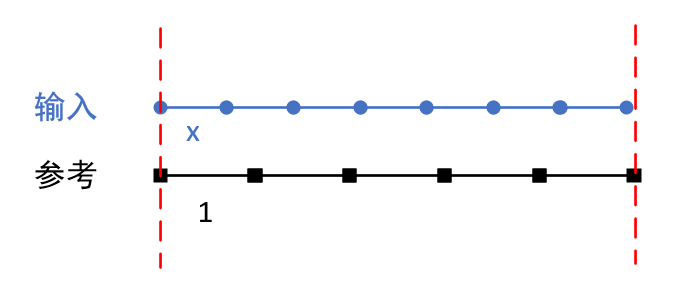
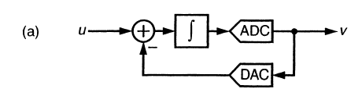
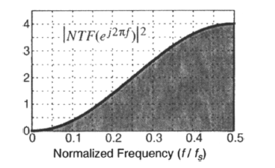
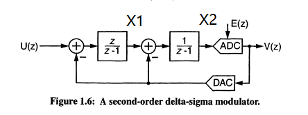
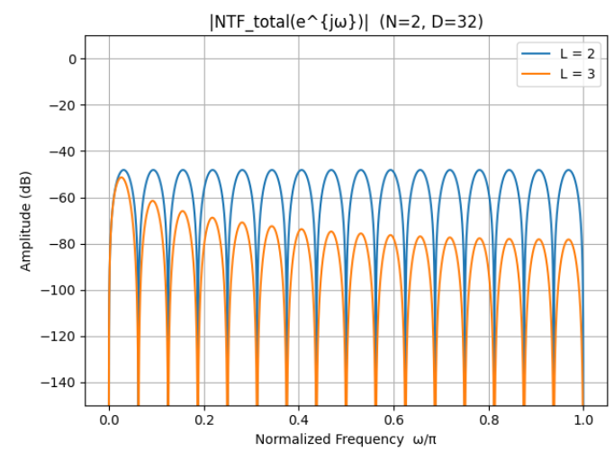
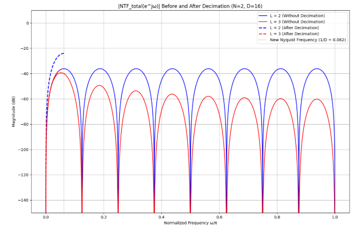

# ΔΣ（Delta-Sigma）ADC 算法原理整理

> 面向算法与系统层级的笔记：聚焦调制器结构与等效模型、传递函数推导、量化噪声整形与SNR/ENOB、稳定性与非理想效应、数字抽取滤波等。

---

## 1. 引言

ΔΣ ADC（又称ΣΔ ADC）通过**过采样（OSR）+ 噪声整形（Noise Shaping）**，将量化噪声搬移到高频，再用数字低通滤波获得高分辨率低带宽的输出。其核心是**线性化后的环路模型**：环路滤波器 + 量化器 + 反馈DAC。

典型应用：音频、传感器读数、电源监测等中低带宽高精度场景。

---

## 2. 一阶Delta-Sigma ADC的理论分析

### 2.1 结构与算法原理

#### 2.1.0 直观物理模型

上图绘制了一种简易的ΔΣ ADC物理模型：对于输入x，通过累加多轮x与参考值1，满足：
$$
\begin{aligned}
S_x[n] &= \sum_{k=0}^{n} x[k] \\
S_y[n] &= \sum_{k=0}^{n} y[k] \\
\text{其中 } y[k] &\in \{0,1\}, \text{ 且满足 } S_y[n] \approx S_x[n] \\
\Rightarrow \hat{x} &= \frac{1}{N}\sum_{k=0}^{N-1} y[k]
\end{aligned}
$$

其中：
- \( S_x[n] \)：输入信号的累加量；
- \( S_y[n] \)：参考信号（输出反馈1/0）的累加量；
- \( y[k] \)：量化输出（1-bit 位流）；
- \( \hat{x} \)：通过输出序列平均值估计得到的输入值。

> 直观理解：当输入 \( x \) 较大时，系统为了保持两者累加接近，会输出更多的“1”；反之则输出更多“0”。最终输出位流中“1”的比例便近似反映输入幅值。

进一步的：
\[
S_x[n]-S_y[n]+e[n]=0
\quad\Longleftrightarrow\quad
-y[n]+\sum_{k=0}^{n}(x[k]-y[k-1]) + e[n]=0.
\]
\[
y[n]=\sum_{k=0}^{n}(x[k]-y[k-1]) +e[n] 
\]
其中：
- \( e[n] \)：x累加和与参考值“1”累加和的误差；
- \(y[-1]=0\)

#### 2.1.1 基本单环结构（离散时间、开关电容版）

- **前向路径（Loop Filter）**：积分器。
- **量化器**：1-bit 或多位（b-bit）闪存量化器。
- **反馈DAC**：将量化输出反馈到输入节点（1-bit: ±Vref；多位：多等级）。
- **过采样**：采样频率 \( f_s = 2 \cdot \text{OSR} \cdot BW \)。

---

### 2.2 传递函数推导（Z 域）

以下以**单环、线性化模型**为例。设环路滤波器传递函数为 \( H(z) \)，量化误差为 \( E(z) \)。

系统如图所示，设积分环节  
\[
G(z) = \frac{1}{z - 1}
\]
第一个加法结输出：
\[
A(z) = U(z) - V(z)
\]

积分块输出：
\[
X(z) = G(z)A(z)
\]

第二个加法结输出(添加量化噪声)：
\[
V(z) = X(z) + E(z) = G(z)\big(U(z) - V(z)\big) + E(z)
\]
\[
V(z)[1 + G(z)] = G(z)U(z) + E(z)
\]

因此：
\[
V(z) = \frac{G(z)}{1 + G(z)}U(z) + \frac{1}{1 + G(z)}E(z)
\]

\[
\boxed{V(z) = z^{-1}U(z) + \Big(1 - z^{-1}\Big)E(z)}
\]

对应时域传递函数：
\[
v(n) = u(n - 1) + e(n) - e(n - 1) 
\]

---

### 2.3 噪声分析（量化噪声、OSR、SNR、ENOB）
#### 2.3.0 量化器的噪声分析
##### 2.3.0.1 量化噪声的均方差

定义量化误差变量 \( e \)，并假设它在区间 \([-\Delta/2, \Delta/2]\) 上是均匀分布的。

均匀分布的概率密度函数 (PDF) 为：

\[
p(e) =
\begin{cases}
\frac{1}{\Delta}, & e \in [-\frac{\Delta}{2}, \frac{\Delta}{2}] \\
0, & \text{其他}
\end{cases}
\]

计算均值 \( E[e] \)：

\[
E[e] = \int_{-\infty}^{\infty} e \, p(e) \, de = \int_{-\frac{\Delta}{2}}^{\frac{\Delta}{2}} e \cdot \frac{1}{\Delta} \, de
\]

\[
E[e] = \frac{1}{\Delta} \int_{-\frac{\Delta}{2}}^{\frac{\Delta}{2}} e \, de = \frac{1}{\Delta} \left[ \frac{e^2}{2} \right]_{-\frac{\Delta}{2}}^{\frac{\Delta}{2}}
\]

\[
E[e] = \frac{1}{\Delta} \left( \frac{(\Delta/2)^2}{2} - \frac{(-\Delta/2)^2}{2} \right)
= \frac{1}{\Delta} \left( \frac{\Delta^2}{8} - \frac{\Delta^2}{8} \right) = 0
\]

计算方差：

由于 \( E[e] = 0 \)，方差简化为：

\[
\sigma_e^2 = E[e^2] = \int_{-\infty}^{\infty} e^2 \, p(e) \, de = \int_{-\frac{\Delta}{2}}^{\frac{\Delta}{2}} e^2 \cdot \frac{1}{\Delta} \, de
\]

\[
\sigma_e^2 = \frac{1}{\Delta} \int_{-\frac{\Delta}{2}}^{\frac{\Delta}{2}} e^2 \, de = \frac{1}{\Delta} \left[ \frac{e^3}{3} \right]_{-\frac{\Delta}{2}}^{\frac{\Delta}{2}}
\]

\[
\sigma_e^2 = \frac{1}{\Delta} \left( \frac{(\Delta/2)^3}{3} - \frac{(-\Delta/2)^3}{3} \right)
= \frac{1}{\Delta} \left( \frac{\Delta^3}{24} + \frac{\Delta^3}{24} \right)
= \frac{1}{\Delta} \cdot \frac{2\Delta^3}{24}
= \frac{\Delta^2}{12}
\]

##### 2.3.0.2 量化噪声的功率谱密度

对白噪声，**两边谱（two-sided）** 功率谱密度PSD 为  
\[
\frac{\sigma_e^2}{f_s}
\]

转为**单边谱（one-sided）** 需乘以 2，于是得到：

\[
S_e(f) = \frac{\Delta^2}{6f_s} \quad (0 \le f \le f_s/2)
\]

#### 2.3.1 量化噪声模型
传递函数中，噪声分量为
\[
q(n) = e(n) - e(n-1)
\]

其Z变换：

\[
Q(z) = (1 - z^{-1}) E(z)
\]

噪声传递函数：
\[
NTF(z) = (1 - z^{-1})
\]
输出噪声的功率谱密度与量化器本身噪声的功率谱密度的关系:
\[
S_q(f) = {|NTF(e^{j2\pi fT})|^2}  S_e(f)
\]

其中：

\[
|NTF(e^{j2\pi fT})|^2 = (2\sin(\pi fT))^2
\]

因此，
\[
S_q(f)= 4\sin^2(\pi fT)  \frac{\Delta^2}{6f_s} \quad (0 \le f \le f_s/2)
\]

进一步地，带内噪声功率\( \sigma_{q,in}^2 \)为是 \( S_q(f) \) 在信号带宽 \([0, f_B]\) 内的积分：

\[
\sigma_{q,in}^2 = \int_0^{f_B} S_q(f)\,df 
= \int_0^{f_B} 4\sin^2(\pi f T)\cdot \frac{\Delta^2}{6 f_s}\,df
\]
对于低频区域（即 \( f \) 较小），由于 \( \pi fT \) 很小，可以使用近似：

\[
\sin(\pi fT) \approx \pi fT
\]

因此：

\[
4\sin^2(\pi fT) \approx 4(\pi fT)^2 = 4\pi^2 f^2 T^2
\]

代入 \( T = \frac{1}{f_s} \)

\[
4\sin^2(\pi fT) \approx 4\pi^2 f^2 \left(\frac{1}{f_s}\right)^2 = \left(\frac{2\pi f}{f_s}\right)^2
\]
将近似代入积分：

\[
\sigma_{q,in}^2 
\approx \int_0^{f_B} 
\left(\frac{2\pi f}{f_s}\right)^2 
\cdot \frac{\Delta^2}{6 f_s}\,df
= \int_0^{f_B} 
\frac{4\pi^2 f^2}{f_s^2} 
\cdot \frac{\Delta^2}{6 f_s}\,df
\]

\[
\sigma_{q,in}^2 
\approx \frac{2\pi^2 \Delta^2}{3 f_s^3} 
\int_0^{f_B} f^2\,df
\]

\[
\sigma_{q,in}^2 
\approx \frac{2\pi^2 \Delta^2}{3 f_s^3} 
\cdot \frac{f_B^3}{3}
= \frac{2\pi^2 \Delta^2 f_B^3}{9 f_s^3}
\]

#### 2.3.2 过采样下收益
由OSR定义\(OSR=\frac{f_s}{2f_B}\)可得：
\[
f_B = \frac{f_s}{2\,OSR}.
\]
代入带内噪声功率公式：
\[
\begin{aligned}
\sigma_{q,\text{in}}^2 
&\approx \frac{2\pi^2\,\Delta^2}{9\,f_s^3}
\cdot \frac{f_s^3}{8\,OSR^3} \\
&= \boxed{\frac{\pi^2\,\Delta^2}{36\,OSR^3}}.
\end{aligned}
\]

#### 2.3.3 有效位数 ENOB (Effective Number of Bits)
在ADC中，
\[
\mathrm{ENOB} = \frac{\mathrm{SNR} - 1.76}{6.02}
\]
SNR为信号与量化噪声的比值，其定义与推导如下：

假设有一个理想 N 位 ADC：
- 输入信号范围为 ±\(V_{FS}\)（满量程）；
- 被均匀分成 \(2^N\) 个量化等级；
- 每个量化步长为：

\[
\Delta = \frac{2V_{FS}}{2^N} = \frac{V_{FS}}{2^{N-1}}
\]
量化误差 \(e\)的 均方值（方差 为：
\[
e_{\mathrm{rms}}^2 = \frac{\Delta^2}{12}
\]
假定输入信号为满幅正弦波：
\[
x(t) = V_{FS} \sin(\omega t)
\]
它的 rms 值（平均功率的平方根）为：

\[
x_{\mathrm{rms}} = \frac{V_{FS}}{\sqrt{2}}
\]
信号功率：

\[
P_{\mathrm{signal}} = x_{\mathrm{rms}}^2 = \frac{V_{FS}^2}{2}
\]
则信号与量化噪声的比值（SNR）：

\[
\frac{P_{\mathrm{signal}}}{P_{\mathrm{noise}}} =
\frac{V_{FS}^2/2}{\Delta^2/12}
= 6 \frac{V_{FS}^2}{\Delta^2}
\]
\[
\frac{P_{\mathrm{signal}}}{P_{\mathrm{noise}}}
= 6 \times 2^{2(N-1)}
= \frac{3}{2} \times 2^{2N}
\]
换算成分贝 (dB)：

\[
\mathrm{SNR} = 10 \log_{10} \left( \frac{3}{2} \times 2^{2N} \right)
= 10 \log_{10} \left( \frac{3}{2} \right) + 20 \log_{10}(2^N)
\]
于是得到经典关系：

\[
\boxed{\mathrm{SNR_{ideal}} = 6.02N + 1.76\ \text{dB}}
\]

因此，有效位数ENOB：

\[
\mathrm{ENOB} = \frac{\mathrm{SNR_{actual}} - 1.76}{6.02}
\]

#### 2.3.4 稳定性与Lee准则
模拟相关，没有深入研究

## 3 高阶Delta-Sigma ADC

### 3.1 传递函数
根据上图：

- 第一级积分器传递函数为：
  \[
  H_1(z) = \frac{z}{z - 1}
  \]

- 第二级积分器传递函数为(先delay一拍，再积分)：
  \[
  H_2(z) = \frac{1}{z - 1}
  \]

定义信号节点，设：
- 输入信号为 \( U(z) \)
- 量化误差为 \( E(z) \)
- 输出信号为 \( V(z) \)
- 两个积分器的输出分别为 \( X_1(z) \)、\( X_2(z) \)

从信号流图可以写出方程：

\[
\begin{cases}
X_1(z) = \frac{z}{z - 1} [ U(z) - V(z) ] \\
X_2(z) = \frac{1}{z - 1} [ X_1(z) - V(z) ] \\
V(z) = X_2(z) + E(z)
\end{cases}
\]

带入求解从第三式：
\[
X_2(z) = V(z) - E(z)
\]

代入第二式：
\[
V(z) - E(z) = \frac{1}{z - 1}[ X_1(z) - V(z) ]
\]
\[
(z - 1)(V(z) - E(z)) = X_1(z) - V(z)
\]
\[
X_1(z) = zV(z) - (z - 1)E(z)
\]

代入第一式：
\[
zV(z) - (z - 1)E(z) = \frac{z}{z - 1}[ U(z) - V(z) ]
\]

化简求得：
两边乘以 \( z - 1 \)：
\[
z(z - 1)V(z) - (z - 1)^2 E(z) = zU(z) - zV(z)
\]

整理关于 \( V(z) \) 的项：
\[
z(z - 1)V(z) + zV(z) = zU(z) + (z - 1)^2 E(z)
\]
\[
z^2 V(z) = zU(z) + (z - 1)^2 E(z)
\]

两边同时除以 \( z^2 \)：
\[
V(z) = z^{-1} U(z) + (1 - z^{-1})^2 E(z)
\]

最终结果：
\[
\boxed{V(z)_{2-order} = z^{-1}U(z) + (1 - z^{-1})^2E(z)}
\]

和一阶的对比：
\[
\boxed{V(z)_{1-order} = z^{-1}U(z) + \Big(1 - z^{-1}\Big)E(z)}
\]

### 3.2 噪声传递函数分析
在频域中，令 $z = e^{j2\pi fT}$，其中 $T = 1/f_s$：

\[
    NTF(f) = (1 - e^{-j2\pi fT})^2 \\
|NTF(f)| = |1 - e^{-j2\pi fT}|^2 = [2\sin(\pi fT)]^2 \\
|NTF(f)|^2 = [2\sin(\pi fT)]^4 = 16\sin^4(\pi fT)
\]

量化器噪声的功率谱密度（单边）为：
\[
S_e(f) = \frac{\Delta^2}{6f_s} \quad (0 \le f \le f_s/2)
\]

输出噪声的功率谱密度为：
\[
S_q(f) = |NTF(f)|^2 \cdot S_e(f) = 16\sin^4(\pi fT) \cdot \frac{\Delta^2}{6f_s}
\]

### 3.3 带内噪声功率计算
对于低频区域（$f \ll f_s$），使用近似：
\[
\sin(\pi fT) \approx \pi fT = \frac{\pi f}{f_s}
\]
因此：
\[
\sigma_{q,in}^2 = \int_0^{f_B} S_q(f) df \approx \int_0^{f_B} \frac{16\pi^4 f^4}{f_s^4} \cdot \frac{\Delta^2}{6f_s} df \\
\sigma_{q,in}^2 \approx \frac{8\pi^4 \Delta^2}{3f_s^5} \int_0^{f_B} f^4 df 
\]
可以推导出：
\[
\sigma_{q,in}^2 \approx \frac{8\pi^4 \Delta^2}{3f_s^5} \cdot \frac{f_B^5}{5} = \frac{8\pi^4 \Delta^2 f_B^5}{15f_s^5}
\]
采用OSR表示：

\[
f_B^5 = \frac{f_s^5}{32 \cdot OSR^5}
\]
带入$ \sigma_{q,in}^2 $:
\[
\sigma_{q,in}^2 \approx \frac{8\pi^4 \Delta^2}{15f_s^5} \cdot \frac{f_s^5}{32 \cdot OSR^5} = \frac{\pi^4 \Delta^2}{60 \cdot OSR^5}
\]
最终结果：
\[
\boxed{\sigma_{q,in}^2 \approx \frac{\pi^4 \Delta^2}{60 \cdot OSR^5}}
\]

### 3.4 SNR与ENOB分析：
#### 3.4.1 信噪比SNR：
假设满幅正弦波输入，信号功率：
\[
P_{signal} = \frac{V_{FS}^2}{2}
\]
对于b位量化器，量化步长：
\[
\Delta = \frac{2V_{FS}}{2^b} = \frac{V_{FS}}{2^{b-1}}
\]
二阶系统的带内噪声功率：
\[
P_{noise} = \sigma_{q,in}^2 \approx \frac{\pi^4}{60 \cdot OSR^5} \cdot \left(\frac{V_{FS}}{2^{b-1}}\right)^2
\]
信噪比：
\[
SNR = \frac{P_{signal}}{P_{noise}} = \frac{V_{FS}^2/2}{\frac{\pi^4 V_{FS}^2}{60 \cdot OSR^5 \cdot 2^{2(b-1)}}} 
\]
\[
SNR = \frac{60 \cdot OSR^5 \cdot 2^{2(b-1)}}{2\pi^4} = \frac{30 \cdot 2^{2b} \cdot OSR^5}{4\pi^4} \\
\]
\[
\boxed{SNR = \frac{15}{2} \cdot \frac{2^{2b} \cdot OSR^5}{\pi^4}}
\]
分贝表示：
\[
SNR_{dB} = 10\log_{10}\left(\frac{15}{2}\right) + 20b\log_{10}(2) + 50\log_{10}(OSR) - 40\log_{10}(\pi)
\]
- $10\log_{10}(15/2) \approx 10\log_{10}(7.5) \approx 8.75$ dB
- $20\log_{10}(2) \approx 6.02$ dB/bit
- $40\log_{10}(\pi) \approx 40 \times 0.497 \approx 19.88$ dB
因此：
\[
    \boxed{SNR_{dB} \approx 6.02b + 50\log_{10}(OSR) - 11.13}
\]
#### 3.4.2 有效位宽ENOB：
\[
ENOB = \frac{SNR_{dB} - 1.76}{6.02} \approx b + \frac{50\log_{10}(OSR) - 12.89}{6.02}
\]

### 3.5 高阶Delta-Sigma ADC的通用推导:
输出噪声的传递函数：
\[
\boxed{NTF(z) = (1 - z^{-1})^N}
\]

输出噪声的功率谱密度：
\[
S_q(f) = |NTF(f)|^2 \cdot S_e(f) = 2^{2N} \sin^{2N}(\pi fT) \cdot \frac{\Delta^2}{6f_s}
\]
带内噪声功率：
\[
\sigma_{q,in}^2 = \int_0^{f_B} S_q(f) df \approx \int_0^{f_B} \frac{2^{2N} \pi^{2N} f^{2N}}{f_s^{2N}} \cdot \frac{\Delta^2}{6f_s} df 
\]
\[
\sigma_{q,in}^2 \approx \frac{2^{2N} \pi^{2N} \Delta^2}{6f_s^{2N+1}} \int_0^{f_B} f^{2N} df
\]
用OSR表示：
\[
f_B^{2N+1} = \frac{f_s^{2N+1}}{2^{2N+1} \cdot OSR^{2N+1}}
\]
\[
\boxed{\sigma_{q,in}^2 \approx \frac{\pi^{2N} \Delta^2}{12 \cdot (2N+1) \cdot OSR^{2N+1}}}  
\]

**SNR**的计算:
对于b位量化器，量化步长：
\[
\Delta = \frac{2V_{FS}}{2^b} = \frac{V_{FS}}{2^{b-1}}
\]
信号功率：
\[
P_{signal} = \frac{V_{FS}^2}{2}
\]
噪声功率：
\[
P_{noise} = \sigma_{q,in}^2 \approx \frac{\pi^{2N}}{12(2N+1) \cdot OSR^{2N+1}} \cdot \left(\frac{V_{FS}}{2^{b-1}}\right)^2
\]

\[
SNR = \frac{P_{signal}}{P_{noise}} = \frac{V_{FS}^2/2}{\frac{\pi^{2N} V_{FS}^2}{12(2N+1) \cdot OSR^{2N+1} \cdot 2^{2(b-1)}}}
\]
\[
SNR = \frac{12(2N+1) \cdot OSR^{2N+1} \cdot 2^{2(b-1)}}{2\pi^{2N}} = \frac{6(2N+1) \cdot 2^{2b} \cdot OSR^{2N+1}}{4\pi^{2N}}
\]
\[
\boxed{SNR = \frac{3(2N+1)}{2} \cdot \frac{2^{2b} \cdot OSR^{2N+1}}{\pi^{2N}}}
\]
分贝表示：
\[
SNR_{dB} = 10\log_{10}\left(\frac{3(2N+1)}{2}\right) + 20b\log_{10}(2) + (2N+1) \cdot 10\log_{10}(OSR) - 2N \cdot 10\log_{10}(\pi)
\]
- $20\log_{10}(2) \approx 6.02$ dB/bit
- $10\log_{10}(\pi) \approx 4.97$ dB
因此：
\[
\boxed{SNR_{dB} \approx 10\log_{10}\left(\frac{3(2N+1)}{2}\right) + 6.02b + (2N+1) \cdot 10\log_{10}(OSR) - 9.94N}
\]

**有效位数:**
\[
\boxed{ENOB \approx b + \frac{(2N+1) \cdot 10\log_{10}(OSR) - 9.94N + 10\log_{10}\left(\frac{3(2N+1)}{2}\right) - 1.76}{6.02}}
\]

## 4 总结：
### 4.6 性能总结

| Order \(N\) | Noise Transfer Function | Output Noise PSD (single-sided) | In-Band Noise Power | OSR Dependence | Noise Roll-Off Slope |
|---|---|---|---|---|---|
| 1 | \((1 - z^{-1})\) | \(S_q(f)=4\,\sin^2(\pi f T)\cdot \dfrac{\Delta^2}{6 f_s}\) | \(\dfrac{\pi^2 \Delta^2}{36 \cdot \mathrm{OSR}^3}\) | \(\mathrm{OSR}^{-3}\) | 20 dB/dec |
| 2 | \((1 - z^{-1})^2\) | \(S_q(f)=16\,\sin^4(\pi f T)\cdot \dfrac{\Delta^2}{6 f_s}\) | \(\dfrac{\pi^4 \Delta^2}{60 \cdot \mathrm{OSR}^5}\) | \(\mathrm{OSR}^{-5}\) | 40 dB/dec |
| \(N\) | \((1 - z^{-1})^N\) | \(S_q(f)=\big(2\sin(\pi f T)\big)^{2N}\cdot \dfrac{\Delta^2}{6 f_s}\) | \(\dfrac{\pi^{2N} \Delta^2}{12(2N+1)\cdot \mathrm{OSR}^{\,2N+1}}\) | \(\mathrm{OSR}^{-(2N+1)}\) | \(20N\) dB/dec |

> Notes: \(T=1/f_s\). Frequency range \(0 \le f \le f_s/2\). Single-sided PSD convention is used.

### 4.7 设计启示

- **阶数选择**：高阶系统提供更好的噪声整形，但稳定性要求更高

- **OSR权衡**：OSR每加倍，N阶系统的SNR改善约 $(2N+1) \times 6$ dB

- **实际限制**：通常N≤4，因为更高阶数会带来稳定性问题

- **应用选择**：
  - 音频应用：通常2-3阶，OSR=64-256
  - 高精度测量：3-4阶，OSR=256-1024
  - 宽带应用：1-2阶，较低OSR以保持带宽

## 5 Delta-Sigma ADC与CIC滤波器的阶数匹配理论分析：

### 5.1 ΔΣ调制器的噪声特性

N阶ΔΣ调制器的噪声传递函数：
\[
NTF(z) = (1 - z^{-1})^N
\]

### 5.2 CIC滤波器基本特性

CIC滤波器传递函数:

\[
H_{CIC}(z) = \left(\frac{1 - z^{-D}}{1 - z^{-1}}\right)^L
\]

### 5.3 ΔΣ域CIC级联的传递函数：
\[
NTF_{total}(z) = NTF(z) \cdot H_{CIC}(z) = (1 - z^{-1})^N \cdot \left(\frac{1 - z^{-D}}{1 - z^{-1}}\right)^L
\]
\[
NTF_{total}(z) = (1 - z^{-1})^{N-L} \cdot (1 - z^{-D})^L
\]
令 $z = e^{j\omega}$，其中 $\omega = 2\pi f/f_s$，进行频域分析，
\[
|NTF_{total}(f)| = |1 - e^{-j\omega}|^{N-L} \cdot |1 - e^{-jD\omega}|^L
\]
使用恒等式 $|1 - e^{-j\theta}| = 2|\sin(\theta/2)|$：
\[
|NTF_{total}(f)| = [2\sin(\pi fT)]^{N-L} \cdot [2\sin(\pi D fT)]^L
\]

当$ L > N $时，CIC会对Delta-ADC整形的高频噪声进行更强的抑制

### 5.4 ΔΣ域CIC级联的幅频响应：
未考虑下采样时：

考虑下采样时：

