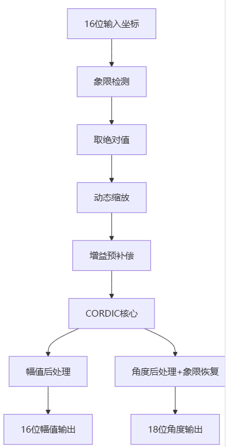

# CORDIC算法：理论、仿真与硬件实现（由坐标得角度）

## 介绍(向量模式)
已知坐标(x, y)，为了计算得到对应角度$\varphi$，每次正/反旋转特定角度$\theta$，将$\varphi$旋转回0度。统计每次旋转的角度$\theta$进而估计出原始角度$\varphi$。

## 算法原理: 0 < $\varphi$ < 90°
**旋转前角度$\varphi$与对应坐标的表达式:**
   \[
   x = \cos(\varphi), \quad y = \sin(\varphi)
   \]
   
**旋转$\theta$后:**
   \[
   x' = \cos(\varphi + \theta), \quad y' = \sin(\varphi + \theta)
   \]

**角度公式展开:**
   \[
   x' = \cos(\varphi + \theta) = \cos\varphi \cdot \cos\theta - \sin\varphi \cdot \sin\theta
   \]
   \[
   y' = \sin(\varphi + \theta) = \sin\varphi \cdot \cos\theta + \cos\varphi \cdot \sin\theta
   \]

   \[\begin{bmatrix} x' \\ y' \end{bmatrix} = \begin{bmatrix} \cos\theta & -\sin\theta \\ \sin\theta & \cos\theta \end{bmatrix} \begin{bmatrix} x \\ y \end{bmatrix}\]

   \[\begin{bmatrix} x' \\ y' \end{bmatrix} = cos{\theta}\begin{bmatrix} 1 & -\tan\theta \\ \tan\theta & 1 \end{bmatrix} \begin{bmatrix} x \\ y \end{bmatrix}\]

由上式可知，旋转后的新坐标(x', y')与旧坐标(x, y)及旋转角$\theta$有关。
   进一步地：
   \[\begin{bmatrix} x* \\ y* \end{bmatrix} = \begin{bmatrix} 1 & -\tan\theta \\ \tan\theta & 1 \end{bmatrix} \begin{bmatrix} x \\ y \end{bmatrix}\]
因此，原(x, y)对应的角度经过若干次(18次)特定角度的旋转，(虽然幅值在不断放大)，可以得到接近0的角度。

观察到(x', y')每次旋转后，幅值增长为$\frac{1}{\cos\theta}$,经过 N 次迭代，总增益因子为：

$$K_N = \prod_{i=0}^{N-1} \sqrt{1+2^{-2i}}$$

对于 18 次迭代：

$$K_{18} = \sqrt{1+1} \cdot \sqrt{1+\frac{1}{4}} \cdot \sqrt{1+\frac{1}{16}} \cdots \sqrt{1+\frac{1}{2^{34}}} \approx 1.64676$$

当 $N \to \infty$ 时，

$$K_\infty \approx 1.646760258$$

# CORDIC 角度查找表 (LUT)

| 索引 (i) | 定点值 (18位) | 角度 (度) |tan(θ)       |
|----------|---------------|-----------|--------------|
| 0        | 131072        | 45.000°   |$2^{-0} = 1$       |
| 1        | 77376         | 26.565°   |$2^{-1} = \frac{1}{2}$    |
| 2        | 40883         | 14.036°   |$2^{-2} = \frac{1}{4}$    |
| 3        | 20753         | 7.125°    |$2^{-3} = \frac{1}{8}$    |
| 4        | 10416         | 3.576°    |$2^{-4} = \frac{1}{16}$   |
| 5        | 5213          | 1.790°    |$2^{-5} = \frac{1}{32}$   |
| 6        | 2607          | 0.895°    |$2^{-6} = \frac{1}{64}$   |
| 7        | 1303          | 0.447°    |$2^{-7} = \frac{1}{128}$  |
| 8        | 651           | 0.224°    |$2^{-8} = \frac{1}{256}$  |
| 9        | 325           | 0.112°    |$2^{-9} = \frac{1}{512}$  |
| 10       | 162           | 0.056°    |$2^{-10} = \frac{1}{1024}$ |
| 11       | 81            | 0.028°    |$2^{-11} = \frac{1}{2048}$ |
| 12       | 40            | 0.014°    |$2^{-12} = \frac{1}{4096}$ |
| 13       | 20            | 0.007°    |$2^{-13} = \frac{1}{8192}$ |
| 14       | 10            | 0.003°    |$2^{-14} = \frac{1}{16384}$|
| 15       | 5             | 0.002°    |$2^{-15} = \frac{1}{32768}$|
| 16       | 2             | 0.001°    |$2^{-16} = \frac{1}{65536}$|
| 17       | 1             | 0.0003°   |$2^{-17} = \frac{1}{131072}$|


## 说明
- **角度范围**：(-99.7°, 99.7°)
- **角度刻度因子**：360° = 2²⁰ = 1,048,576 单位
- **精度**：1 LSB = 360°/1,048,576 ≈ 0.000343°

## 拓展至： 0 < $\varphi$ < 360°

前文所述cordic算法适用于一四象限坐标的角度计算，硬件设计时，为了计算所有象限坐标对应的角度，采用如下方法：
 - 根据x/y符号位判断象限
 - 对x/y取绝对值，进而转至第一象限
 - 计算cordic角度
 - 根据第一步得到的象限，恢复角度：
   - 第一象限：$\theta$
   - 第二象限：180° - $\theta$
   - 第三象限：180° + $\theta$
   - 第四象限：360° - $\theta$

## 补充1：输入坐标的幅值调整

对于输入的坐标(x, y), 若幅值过小，对于$x' = x - \frac{y}{8}$的运算，精度会下降，造成角度误差增加。因此实际计算前，会将坐标进行放大至：**[16384, 32767]**。

获取放大位数的小技巧：

```
# 由于已取绝对值，reg_x_new是U16，信号幅值(0, 32767)
# 从最高位开始判断，连续进行判断
# 若信号幅度16384 ~ 32767, reg_x_new[14]为1，否则为0
# 若信号幅度8192 ~ 16383，reg_x_new[13]为1，否则为0，以此类推
wire[3:0] x_scale_shift = reg_x_new[15] ^  reg_x_new[14] ? 'd0 :
                          reg_x_new[14] ^  reg_x_new[13] ? 'd1 : 
                          reg_x_new[13] ^  reg_x_new[12] ? 'd2 : 
                          reg_x_new[12] ^  reg_x_new[11] ? 'd3 : 
                          reg_x_new[11] ^  reg_x_new[10] ? 'd4 : 
                          reg_x_new[10] ^  reg_x_new[ 9] ? 'd5 : 
                          reg_x_new[ 9] ^  reg_x_new[ 8] ? 'd6 : 
                          reg_x_new[ 8] ^  reg_x_new[ 7] ? 'd7 : 
                          reg_x_new[ 7] ^  reg_x_new[ 6] ? 'd8 : 
                          reg_x_new[ 6] ^  reg_x_new[ 5] ? 'd9 : 
                          reg_x_new[ 5] ^  reg_x_new[ 4] ? 'd10: 
                          reg_x_new[ 4] ^  reg_x_new[ 3] ? 'd11: 
                          reg_x_new[ 3] ^  reg_x_new[ 2] ? 'd12: 
                          reg_x_new[ 2] ^  reg_x_new[ 1] ? 'd13: 
                          reg_x_new[ 1] ^  reg_x_new[ 0] ? 'd14: 'd15; 
```

## 补充2：信号幅值的计算($\sqrt{x^2 + y^2}$) 

在原始信号坐标进行旋转的时候，逐渐靠近X轴。因此，根据最后一次旋转输出的x'即可推算出原始信号的幅值。
\[
   (r * scale * \frac{1}{1.64676}) * 1.64676= r \\
\]
其中，$\frac{1}{1.64676} = \frac{159187}{2^{18}}$,对应的U18定点系数为159187。
1.64676为经过18次旋转后，信号幅值的增益。scale为输入坐标在cordic之前的预增益。

需注意，当前磁编码器项目中，在cordic之前，先进行预补偿，即$\frac{1}{1.64676}$, 实际可以将这一步去掉或放到幅值后处理的地方，以降低噪声

# 完整流程图



# 