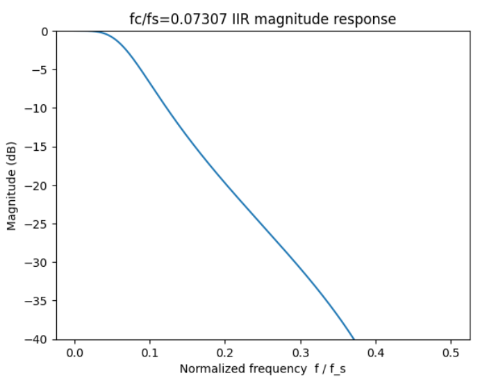
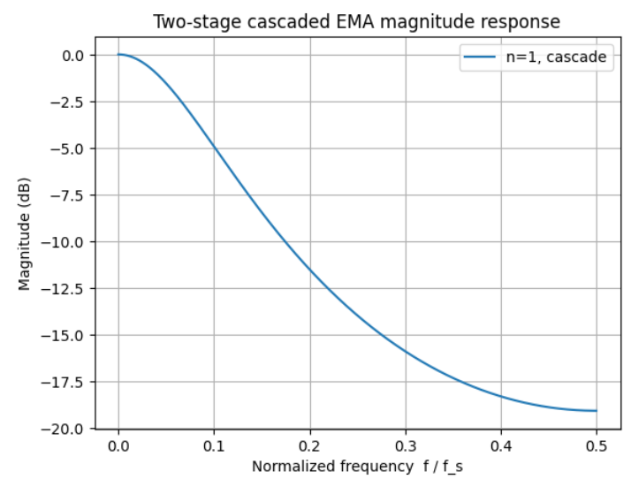
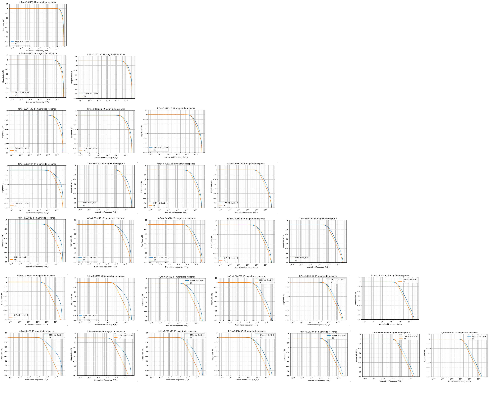

# 一阶低通指数滑动平均滤波器（EMA IIR）
## 1 时域模型与Z域模型
\[
y[n] = \alpha x[n] + (1-\alpha) y[n-1], \quad 0 < \alpha \le 1
\]
其系统函数：
\[
H(z) = \frac{Y(z)}{X(z)} = \frac{\alpha}{1 - (1 - \alpha) z^{-1}}
\]
对照通用形式：
\[
H(z) = \frac{b_0 + b_1 z^{-1}}{1 + a_1 z^{-1}}
\]
得：
\[
b_0 = \alpha, \quad b_1 = 0, \quad a_1 = -(1 - \alpha)
\]
低频增益 $ (z = 1) $：
\[
H(1) = \frac{\alpha}{1 - (1 - \alpha)} = 1
\]

高频增益 $ (z = -1) $：
\[
H(1) = \frac{1}{1 - (\alpha - 1)} = \frac{1}{2 - \alpha}
\]

## 2 零极点与频率响应
- **极点**：\(p = 1 - \alpha\)（位于实轴，\(0 < \alpha < 1 \Rightarrow |p| < 1\)，系统稳定）
- **零点**：无（有限零点），等价为在 \(z = \infty\) 处一个零

- **频率响应：**
\[
H(e^{j\omega}) = \frac{\alpha}{1 - (1 - \alpha) e^{-j\omega}} \\ 
|H(e^{j\omega})|^2 = \left( \frac{\alpha}{1 - (1 - \alpha) e^{-j\omega}} \right) \cdot \left( \frac{\alpha}{1 - (1 - \alpha) e^{j\omega}} \right) = \frac{\alpha^2}{ [1 - (1 - \alpha) e^{-j\omega}] [1 - (1 - \alpha) e^{j\omega}] } 
\]
带入欧拉公式：
\[
e^{j\omega} + e^{-j\omega} = 2 \cos \omega 
\]
可以得到：
\[
\quad |H(e^{j\omega})|^2 = \frac{\alpha^2}{1 + (1 - \alpha)^2 - 2(1 - \alpha) \cos\omega} \\
\]

- **截止频率：**
\[
|H(e^{j\omega_c})|^2 = \frac{1}{2} \\
\]
带入可以得到：
\[
2\alpha^2 = 1 + (1 - 2\alpha + \alpha^2) - 2(1 - \alpha) \cos \omega_c
\]
\[
2\alpha^2 = 2 - 2\alpha + \alpha^2 - 2(1 - \alpha) \cos \omega_c
\]
\[
\alpha^2 = 2 - 2\alpha - 2(1 - \alpha) \cos \omega_c
\]
\[
2(1 - \alpha) \cos \omega_c = 2 - 2\alpha - \alpha^2
\]
\[
\cos \omega_c = \frac{2 - 2\alpha - \alpha^2}{2(1 - \alpha)}
\]
截止频率 $ω_c$ 满足：
\[
\cos \omega_c = 1 - \frac{\alpha^2}{2(1 - \alpha)}
\]
最终得到：
\[
\boxed{\omega_c = \arccos \left( 1 - \frac{\alpha^2}{2(1 - \alpha)} \right) \\
\quad f_c = \frac{f_s}{2\pi}  \arccos \left( 1 - \frac{\alpha^2}{2(1 - \alpha)} \right)}
\]
- **建立时间：**

极点(模值)：
\[
    p = 1 - \alpha
\]
建立时间计算方法(衰减到$\beta = 0.01$)：
\[
\boxed{p^N = \beta} \\
N = \frac{log(\beta)}{log(p)} = \frac{log(\beta)}{log(1 - \alpha)} \\
\]

## 3 典型值汇总（便于工程选型）：

| \(N\) | \(\alpha\) | \(f_c / f_s\) | setup time(β=0.01) |
|---:|---:|---:|---:|
| 0   | 1.0      | 0.0     | 0.0    |
| 1   | 0.5      | 0.1150  | 6.64   |
| 2   | 0.25     | 0.0461  | 16.01  |
| 3   | 0.125    | 0.0213  | 34.49  |
| 4   | 0.0625   | 0.0107  | 71.36  |
| 5   | 0.03125  | 0.0054  | 145.05 |
| 6   | 0.015625 | 0.0027  | 292.42 |
| 7   | 0.0078125| 0.0014  | 587.16 |

# 二阶低通指数滑动平均滤波器（EMA IIR）

## 1 时域模型与Z域模型

- **时域方程（\(\alpha_1,\alpha_2\)）：**

\[
\begin{cases}
u[n] = \alpha_1\,x[n] + (1-\alpha_1)\,u[n-1] \\
y[n] = \alpha_2\,u[n] + (1-\alpha_2)\,y[n-1]
\end{cases}
\qquad 0<\alpha_1,\alpha_2\le 1
\]

- **Z域方程（\(\alpha_1,\alpha_2\)）：**
\[
H(z)=\frac{\alpha_1\alpha_2}{\left[1-(1-\alpha_1)z^{-1}\right]\left[1-(1-\alpha_2)z^{-1}\right]}
= \frac{\alpha_1\alpha_2}{1-\big[(1-\alpha_1)+(1-\alpha_2)\big]z^{-1}+(1-\alpha_1)(1-\alpha_2)z^{-2}}
\]
- **(补充二阶IIR通用形式）**
\[
H(z)=\frac{b_0+b_1 z^{-1}+b_2 z^{-2}}{1+a_1 z^{-1}+a_2 z^{-2}}
\]

- **针对 \(\alpha_1,\alpha_2\) ：**
\[
b_0=\alpha_1\alpha_2,\quad b_1=0,\quad b_2=0;\qquad
a_1=-\big[(1-\alpha_1)+(1-\alpha_2)\big]=\alpha_1+\alpha_2-2,\quad
a_2=(1-\alpha_1)(1-\alpha_2).
\]

- **低频增益（\(z=1\)）**：两种情形均有
\[
H(1)=1.
\]

- **高频增益（\(z=-1\)）**：
  - \(\alpha_1,\alpha_2\)：\(\displaystyle H(-1)=\frac{\alpha_1\alpha_2}{(2-\alpha_1)(2-\alpha_2)}\).

## 2 零极点与频率响应

- **极点**：\(p_1 = 1-\alpha_1\), \(p_2 = 1-\alpha_2\)。  
- **零点**：有限平面无零点，可等价视为 \(z=\infty\) 处两个零点。
- **频率响应（一般情形）**：
\[
H(e^{j\omega})=\frac{\alpha_1\alpha_2}{\bigl(1-r_1 e^{-j\omega}\bigr)\bigl(1-r_2 e^{-j\omega}\bigr)} \\
|H(e^{j\omega})|^2=\frac{\alpha_1^2\alpha_2^2}{\bigl(1+r_1^2-2r_1\cos\omega\bigr)\bigl(1+r_2^2-2r_2\cos\omega\bigr)}
\]
对于二阶EMA滤波器，很难继续由理论进行分析，需通过仿真得到

- **建立时间：**

极点(模值)：
\[
p_1 = 1 - \alpha_1, \quad p_2 = 1 - \alpha_2
\]

建立时间由主导极点（模值较大的极点）决定(衰减到$\beta = 0.01$)：
\[
N = \frac{\log(\beta)}{\log(\max(|1-\alpha_1|, |1-\alpha_2|))}
\]

更精确地，建立时间应满足下式，但是无法直接求解：
\[
|K_1||p_1|^N + |K_2||p_2|^N \leq \beta
\]

## 3 典型值汇总（便于工程选型）：

| n1 \ n0 | 0        | 1        | 2        | 3        | 4        | 5        | 6        | 7        |
|---------|----------|----------|----------|----------|----------|----------|----------|----------|
| 0       | NaN      | 0.115027 | 0.046105 | 0.021284 | 0.010275 | 0.005053 | 0.002506 | 0.001248 |
| 1       | 0.115027 | 0.073070 | 0.040477 | 0.020583 | 0.010191 | 0.005043 | 0.002505 | 0.001248 |
| 2       | 0.046105 | 0.040477 | 0.029612 | 0.018176 | 0.009816 | 0.004994 | 0.002499 | 0.001247 |
| 3       | 0.021284 | 0.020583 | 0.018176 | 0.013692 | 0.008684 | 0.004802 | 0.002473 | 0.001244 |
| 4       | 0.010275 | 0.010191 | 0.009816 | 0.008684 | 0.006612 | 0.004251 | 0.002376 | 0.001231 |
| 5       | 0.005053 | 0.005043 | 0.004994 | 0.004802 | 0.004251 | 0.003252 | 0.002104 | 0.001182 |
| 6       | 0.002506 | 0.002505 | 0.002499 | 0.002473 | 0.002376 | 0.002104 | 0.001613 | 0.001047 |
| 7       | 0.001248 | 0.001248 | 0.001247 | 0.001244 | 0.001231 | 0.001182 | 0.001047 | 0.000803 |

# 二阶IIR与二阶EMA带外抑制比较
- **IIR比ema具有更稳定的带内平稳度与带外衰减**

以$\frac{f_c}{f_s} = 0.073070$为例

# 一阶EMA的改善型，EMA_V2 
## 1 时域模型与Z域模型
\[
y[n] = \boxed{\alpha \frac{(x[n] + x[n-1])}{2}} + (1-\alpha) y[n-1], \quad 0 < \alpha \le 1
\]
其系统函数：
\[
H(z) = \frac{Y(z)}{X(z)} = \frac{\frac{\alpha}{2}+\frac{\alpha}{2}z^{-1}}{1 - (1 - \alpha) z^{-1}}
\]
对照通用形式：
\[
H(z) = \frac{b_0 + b_1 z^{-1}}{1 + a_1 z^{-1}}
\]
得：
\[
b_0 = \frac{\alpha}{2}, \quad b_1 = \frac{\alpha}{2}, \quad a_1 = -(1 - \alpha)
\]
低频增益 $ (z = 1) $：
\[
H(1) = \frac{\alpha}{1 - (1 - \alpha)} = 1
\]

高频增益 $ (z = -1) $：
\[
H(1) = \frac{0}{1 - (\alpha - 1)} = 0
\]

## 2 零极点与幅频响应分析

**零点**：令分子为零  
  $$
  \tfrac{\alpha}{2}(z+1)=0 \;\;\Rightarrow\;\; z=-1,
  $$
  在单位圆上，对应 $\omega=\pi$ 处具有陷波/零点。

**极点**：令分母为零  
  $$
  z-(1-\alpha)=0 \;\;\Rightarrow\;\; z=1-\alpha.
  $$
  因 $0<\alpha\le 1$，有 $|p|=|1-\alpha|<1$，系统 **稳定**。

**频率响应：**

对于 $H(z)$:
\[
H(z) = \frac{Y(z)}{X(z)} = \frac{\frac{\alpha}{2}+\frac{\alpha}{2}z^{-1}}{1 - (1 - \alpha) z^{-1}}
\]
\[z=e^{j\omega}\]
得到：
\[
H(e^{j\omega}) \;=\; \frac{\tfrac{\alpha}{2}\bigl(e^{j\omega}+1\bigr)}{\,e^{j\omega}-(1-\alpha)\,}.
\]
利用欧拉恒等式 \[
e^{j\omega}+1=2e^{j\omega/2}\cos(\omega/2)\]
得：
\[
H(e^{j\omega}) \;=\; \frac{\alpha\,e^{j\omega/2}\cos(\omega/2)}{\,e^{j\omega}-(1-\alpha)\,}.
\]
幅频响应平方：
\[
\bigl|H(e^{j\omega})\bigr|^2
= \frac{\alpha^2\cos^2(\omega/2)}
{\bigl(e^{j\omega}-(1-\alpha)\bigr)\bigl(e^{-j\omega}-(1-\alpha)\bigr)}
= \frac{\alpha^2\cos^2(\omega/2)}
{\,1+(1-\alpha)^2-2(1-\alpha)\cos\omega\,}.
\]
> 注：直流增益  
> $$
> |H(e^{j\cdot 0})|^2=\frac{\alpha^2}{\,\alpha^2\,}=1 \;\Rightarrow\; |H(0)|=1.
> $$
**截止频率：**

令 \[\bigl|H(e^{j\omega_c})\bigr|^2=\tfrac12\]
代入得: 
\[
\frac{\alpha^2\cos^2(\omega_c/2)}{\,1+(1-\alpha)^2-2(1-\alpha)\cos\omega_c\,}
= \frac{1}{2}.
\]

两边同乘并利用 
\[
  \cos^2(\omega/2)=\tfrac{1+\cos\omega}{2}
\]
化简可得:
\[
\cos\omega_c \;=\; \frac{2(1-\alpha)}{\,\alpha^2+2(1-\alpha)}
\]

因此
\[
\omega_c \;=\; \arccos\!\left(\frac{2(1-\alpha)}{\alpha^2+2(1-\alpha)}\right), 
\qquad
f_c \;=\; \frac{f_s}{2\pi}\,\omega_c.
\]
**建立时间：**

极点模值：
\[
  p=1-\alpha
\] 
当响应衰减到比例 $\beta$（如 $\beta=0.01$）时，取
\[
p^N=\beta \;\;\Rightarrow\;\; 
\boxed{N=\frac{\ln\beta}{\ln p}=\frac{\ln\beta}{\ln(1-\alpha)}}
\]
## 3 定点实现与量化噪声：
**定点实现:**
\[
y_{\text{fixed}}
= \Bigl(\bigl(\,(x + x_{1}) \ll (N-1) - y_{1}\,\bigr) \gg n_{1}\Bigr) + y_{1}
\]
其中，$N$为反馈$y$的小数位宽，$n_1$为滤波器系数。

**量化误差分析:**

前向传播时：$y_1$为带噪变量，其量化误差为:
\[
  \delta_{y} = \frac{1}{2^N}
\]
反馈增益：
\[
  G = \frac{1}{\Sigma{a}} = \frac{1}{\alpha}=2^{n_1}
\]
平均量化误差：
\[
  Err = \frac{G * \delta_{y}}{2} = (\frac{1}{2})^{N+1-n_1}
\]
量化误差均方差：
\[
  Var = \sqrt{\frac{1}{12}} Err \approx 0.289 Err
\]

# 二阶EMA_v2的公式推导并与二阶IIR进行比较
## 1 Z域模型与时域模型

**一阶EMA滤波器的传递函数：**
\[
H(z) = \frac{Y(z)}{X(z)} = \frac{\frac{\alpha}{2}+\frac{\alpha}{2}z^{-1}}{1 - (1 - \alpha) z^{-1}}
\]
**二阶EMA滤波器的传递函数：**
\[
H_{\text{tot}}(z)\;=\;H(z)^2
=\frac{\bigl(\tfrac{\alpha}{2}\bigr)^2(1+z^{-1})^2}{\bigl(1-(1 - \alpha) z^{-1}\bigr)^2}=\
\frac{\tfrac{\alpha^2}{4}\,(1+2z^{-1}+z^{-2})}{1-2(1-\alpha)z^{-1}+(1-\alpha)^2 z^{-2}}
\]
**频域转时域：**
\[
\,y[n]-2(1-\alpha)\,y[n-1]+(1-\alpha)^2\,y[n-2]
=\frac{\alpha^2}{4}\,x[n]+\frac{\alpha^2}{2}\,x[n-1]+\frac{\alpha^2}{4}\,x[n-2]\, 
\]
**时域方程：**
\[
\boxed{y[n]=\frac{\alpha^2}{4}x[n]+\frac{\alpha^2}{2}x[n-1]+\frac{\alpha^2}{4}x[n-2]+2(1-\alpha)\,y[n-1]-(1-\alpha)^2 y[n-2]}
\]

## 2 二阶EMA_v2的截止频率及幅频响应

归一化截止频率(fc/fs)与滤波器系数的关系$\alpha ={(\frac{1}{2})}^n$：

| n1 \ n2 |      0     |      1     |      2     |      3     |      4     |      5     |      6     |
|:-------:|-----------:|-----------:|-----------:|-----------:|-----------:|-----------:|-----------:|
|    0    | 0.181735   | 0.093703   | 0.044199   | 0.021047   | 0.010230   | 0.005039   | 0.002500   |
|    1    | 0.093703   | 0.067136   | 0.039256   | 0.020372   | 0.010147   | 0.005029   | 0.002499   |
|    2    | 0.044199   | 0.039256   | 0.029125   | 0.018032   | 0.009776   | 0.004980   | 0.002493   |
|    3    | 0.021047   | 0.020372   | 0.018032   | 0.013622   | 0.008654   | 0.004789   | 0.002467   |
|    4    | 0.010230   | 0.010147   | 0.009776   | 0.008654   | 0.006594   | 0.004241   | 0.002370   |
|    5    | 0.005039   | 0.005029   | 0.004980   | 0.004789   | 0.004241   | 0.003245   | 0.002099   |
|    6    | 0.002500   | 0.002499   | 0.002493   | 0.002467   | 0.002370   | 0.002099   | 0.001610   |

