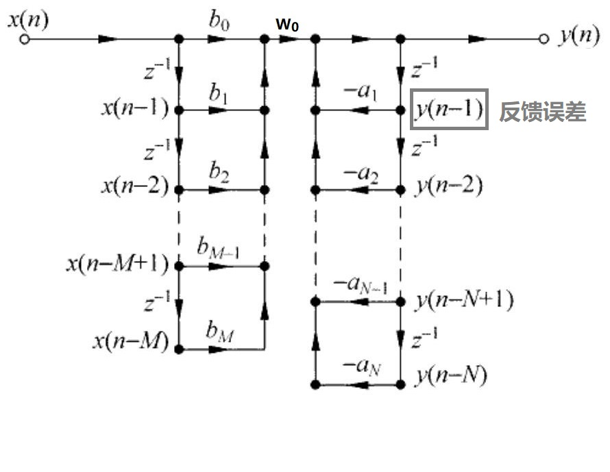
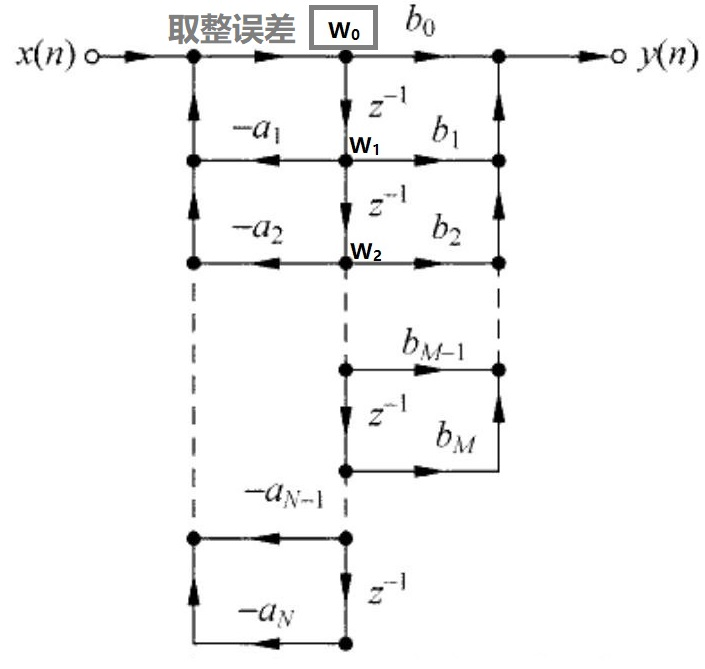

# 直接Ⅰ型与直接Ⅱ型 二阶 Butterworth IIR （低通）滤波器的差异

## 浮点低通滤波器的时域/频域形式
时域：
$$
y[n] = b_0 x[n] + b_1 x[n-1] + b_2 x[n-2] - a_1 y[n-1] - a_2 y[n-2]
$$
频域：
$$
H(z) = \frac{Y(z)}{X(z)} = \frac{b_0 + b_1 z^{-1} + b_2 z^{-2}}{1 + a_1 z^{-1} + a_2 z^{-2}}
$$
其中，
## 直接Ⅰ型与直接Ⅱ型

### 等价推导：

Z域传递函数：
$$
H(z) = \frac{Y(z)}{X(z)} = \frac{b_0 + b_1 z^{-1} + b_2 z^{-2}}{1 + a_1 z^{-1} + a_2 z^{-2}}
$$
$$
Y_{Form1}(z)= [X(z) \cdot (b_0 + b_1 z^{-1} + b_2 z^{-2})] \cdot \frac{1}{1 + a_1 z^{-1} + a_2 z^{-2}}
$$
$$
Y_{Form2}(z) = [X(z) \cdot \frac{1}{1 + a_1 z^{-1} + a_2 z^{-2}}] \cdot (b_0 + b_1 z^{-1} + b_2 z^{-2})
$$
Z域乘积对应时域的级联：x[n] →  → w[n] →  → y[n]

**直接Ⅰ型的Z域可以展开为：**
$$
W_{Form1}(z) = X(z) \cdot (b_0 + b_1 z^{-1} + b_2 z^{-2})
$$
$$
Y_{Form1}(z) = W_{Form1}(z) \cdot \frac{1}{1 + a_1 z^{-1} + a_2 z^{-2}}
$$
**直接Ⅰ型的时域可以展开为：**
$$
w_0 = b_0 x[n] + b_1 x[n-1] + b_2 x[n-2]
$$
$$
y[n] = w_0 - a_1 y[n-1] + a_2 y[n-2]
$$

**直接Ⅱ型的Z域可以展开为：**
$$
W_{Form2}(z) = X(z) \cdot \frac{1}{1 + a_1 z^{-1} + a_2 z^{-2}}
$$
$$
Y_{Form2}(z) = W_{Form2}(z) \cdot (b_0 + b_1 z^{-1} + b_2 z^{-2})
$$
**直接Ⅱ型的时域可以展开为：**
$$
w_0 = b_0 x[n] - a_1 w_1 - a_2 w_2
$$
$$
y[n] = b_0 w_0 + b_1 w_1 + b_2 w_2
$$

**直接Ⅰ型与直接Ⅱ型的示意如下：**

### 量化误差分析：
#### 系数误差(系统误差)

浮点滤波器：
$$
H^f(z) = \frac{Y^f(z)}{X(z)} = \frac{b_0^f + b_1^f z^{-1} + b_2^f z^{-2}}{1 + a_1^f z^{-1} + a_2^f z^{-2}}
$$
定点后：
$$
H^q(z) = \frac{Y^q(z)}{X(z)} = \frac{b_0^q + b_1^q z^{-1} + b_2^q z^{-2}}{1 + a_1^q z^{-1} + a_2^q z^{-2}}
$$
系数引起的输出量化误差：
$$
Err(z) = (H^f(z) - H^q(z)) * X(z)
$$
此项误差请参考误差分析的相关文档

#### 前馈与反馈误差(设计引入误差)

**环路增益：**
\[
    G(z) = |\frac{1}{1+a_1z_1+a_2z_2}|
\]

**直接Ⅰ型量化误差：**

来源于反馈的小数部分截取，并经过环路增益$G(z)$得到增强；因此反馈$y_1 y_2$需添加小数位，满足总的量化误差 < 1 lsb

**直接Ⅱ型量化误差：**

来源于中间缓存w的小数位截取，并经过环路增益$G(z)$得到增强；与直接Ⅰ型不同的是，直接Ⅱ型的w引入的量化误差会由次级的$b_0, b_1, b_2$进行衰减，因此中间缓存w无需保留小数位即可满足精度需求
