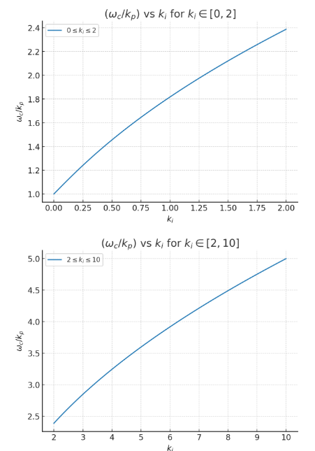
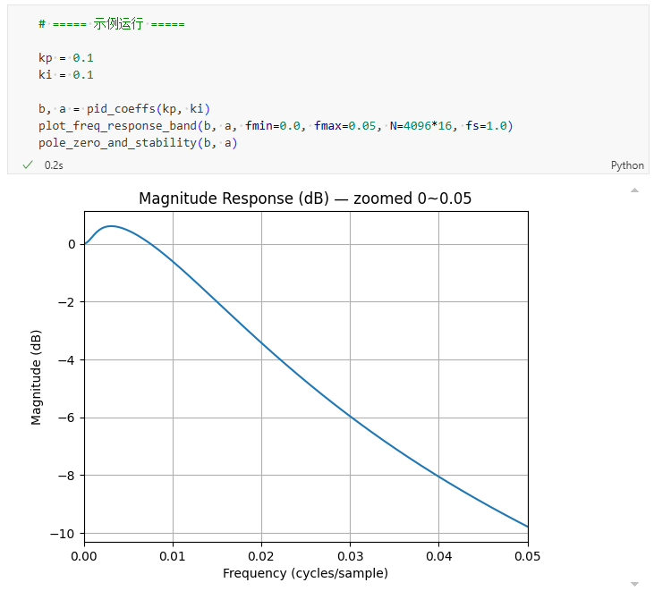

# Trackloop 频率响应分析

# 结构
```
x(t)-y(t)  e(t)          PI控制器        u(t)  积分器     y(t)
------->(-)---->[ Kp*e(t) + Ki*∫(e(t)) ]---->[∫(u(t))]---------->
         ^                                      |
         |                                      |
         |                y(t)                  |
         ----------------------------------------
```
* 误差信号为 $e(t) = x(t) - y(t)$
* PI控制器的输出为 $u(t) = K_p e(t) + K_i \int e(t) dt$，其中 $K_p$ 是比例增益，$K_i$ 是积分增益
* 最终输出通过积分器得到，即 $y(t) = \int u(t) dt$
## S域分析
前向路径传递函数(从误差 $E(s)$ 到输出 $Y(s)$)为:
$$
G(s) = (K_p + K_i/s) * (1/s) = K_p/s + K_i/s^2
$$
反馈路径传递函数为:
$$
H(s) = 1
$$
闭环传递函数：
$$
T(s) =  \frac{G(s)}{1+G(s)H(s)} 
= \frac{\tfrac{K_p}{s} + \tfrac{K_i}{s^2}}{1 + \tfrac{K_p}{s} + \tfrac{K_i}{s^2}}
= \frac{K_p s + K_i}{s^2 + K_p s + K_i}
$$

### 截止频率计算
系统的特征方程为：

$$
s^2 + K_p s + K_i = 0
$$

保持系统稳定，需要所有根的实部<0, 保证系统是衰减的，即 $K_p > 0, K_i > 0$

截止角频率 $\omega_c$ 通常定义为幅值响应下降至 -3dB 处的频率，可通过求解下式得到：

$$
|H(j\omega_c)| = \frac{1}{\sqrt{2}}
$$

具体计算式为：

$$
\left|\frac{jK_p\omega_c + K_i}{-\omega_c^2 + jK_p\omega_c + K_i}\right| = \frac{1}{\sqrt{2}}
$$

进一步推导：

**步骤1：计算复数模值**

分子模值：
$$
\left| jK_p \omega_c + K_i \right| 
= \sqrt{(K_p \omega_c)^2 + K_i^2}
$$

分母模值：
$$
\left| -\omega_c^2 + jK_p \omega_c + K_i \right|
= \sqrt{(\omega_c^2 - K_i)^2 + (K_p \omega_c)^2}
$$

---

**步骤2：代入原方程**

$$
\frac{(K_p \omega_c)^2 + K_i^2}{(\omega_c^2 - K_i)^2 + (K_p \omega_c)^2} = \frac{1}{2}
$$

---

**步骤3：两边平方**

$$
\frac{(K_p \omega_c)^2 + K_i^2}{(\omega_c^2 - K_i)^2 + (K_p \omega_c)^2} = \frac{1}{2}
$$

---

**步骤4：交叉相乘**

$$
2 \left[ (K_p \omega_c)^2 + K_i^2 \right]
= (\omega_c^2 - K_i)^2 + (K_p \omega_c)^2
$$

---

**步骤5：展开并整理**

$$
2K_p^2 \omega_c^2 + 2K_i^2
= \omega_c^4 - 2K_i \omega_c^2 + K_i^2 + K_p^2 \omega_c^2
$$

整理得：

$$
\omega_c^4 - (2K_i + K_p^2)\omega_c^2 - K_i^2 = 0
$$

---

**步骤6：解二次方程**

令 $x = \omega_c^2$，则方程变为：

$$
x^2 - (2K_i + K_p^2)x - K_i^2 = 0
$$

解得：

$$
x = \frac{(2K_i + K_p^2) \pm \sqrt{(2K_i + K_p^2)^2 + 4K_i^2}}{2}
$$

由于频率必须为正实数，取正号解：

$$
\omega_c^2 = \frac{(2K_i + K_p^2) + \sqrt{(2K_i + K_p^2)^2 + 4K_i^2}}{2}
$$

---

**步骤7：最终关系式**

截止角频率 $\omega_c$ 与控制器参数 $K_p, K_i$ 的关系为：

$$
\omega_c =
\sqrt{
\frac{(2K_i + K_p^2) + \sqrt{(2K_i + K_p^2)^2 + 4K_i^2}}{2}
}
$$

---

**步骤8：磁编码器的项目应用**

磁编码器中，$K_i=k_i*k_p^2$，上式可以继续优化：
$$
\omega_c = k_p \sqrt{ \frac{(2k_i + 1) + \sqrt{8k_i^2 + 4k_i + 1}}{2} }
$$

$$
\frac{\omega_c}{k_p}=\sqrt{ \frac{(2k_i + 1) + \sqrt{8k_i^2 + 4k_i + 1}}{2}}
$$



---


### 频率响应特性

#### 低频响应 ($\omega \to 0$)
$$
|H(j\omega)| \approx 1
$$
系统在低频时直通。

#### 高频响应 ($\omega \to \infty$)
$$
|H(j\omega)| \approx \frac{K_p}{\omega}\approx 0
$$
系统在高频时衰减至0。
---

## Z域分析

- 误差信号： $e[n] = r[n] - y[n-1]$
- PI 控制器输出： $u[n] = K_p e[n] + K_i \sum_{k=0}^n e[k]$
- 系统输出：$y[n] = y[n-1] + u[n]$

---
## Z 域推导
### 误差信号
$$
E(z) = X(z) - z^{-1}Y(z)
$$
### PI的积分状态（累加和）
$$
S(z) = \frac{1}{1 - z^{-1}} E(z)
$$
### PI 控制器输出
$$
U(z) = K_p E(z) + K_i S(z) 
= E(z)\left(K_p + \frac{K_i}{1 - z^{-1}}\right)
$$

### 输出方程
$$
Y(z) = z^{-1}Y(z) + U(z) 
\quad \Rightarrow \quad
Y(z) =  \frac{U(z)}{(1 - z^{-1})}
$$

### 闭环传递函数

代入 $U(z)$ 与 $E(z)$：
$$
Y(z)(1 - z^{-1}) = (X(z) - z^{-1}Y(z)) \left( K_p + \frac{K_i}{1 - z^{-1}} \right)
$$

整理得到：

$$
H(z) = \frac{Y(z)}{X(z)} 
= \frac{(K_p + K_i)z^2 - K_p z}{z^2 + (K_p + K_i - 2)z + (1 - K_p)}
= \frac{(K_p + K_i) - K_p z^{-1}}{1 + (K_p + K_i - 2)z^{-1} + (1 - K_p)z^{-2}}
$$

### 时域差分方程

由传递函数得到差分方程：
$$
y[n] + (K_p + K_i - 2)y[n-1] + (1 - K_p)y[n-2] 
= (K_p + K_i)x[n] - K_p x[n-1]
$$

---

### 磁编码器应用的时域差分方程
在磁编码器中，$K_p=k_p$,$K_i=k_p*k_i^2$,差分方程可以改为：
$$
y[n] = (k_p + k_p*k_i^2)x[n] - k_p x[n-1] - (k_p + k_p*k_i^2 - 2)y[n-1] - (1 - k_p)y[n-2] 
$$

---

## 时域差分方程的频谱相应
#### 更多$k_p, k_i$参数测试，可以直接运行附件 “spectrum_correspondence.ipynb” 


